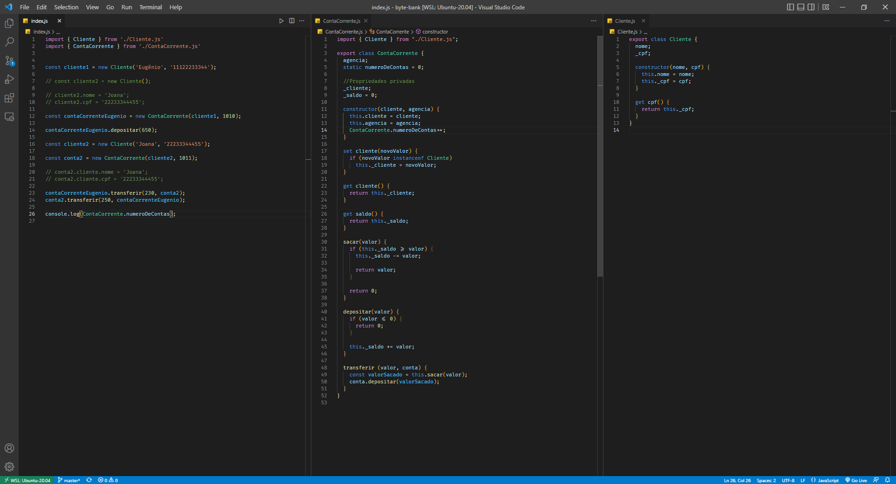
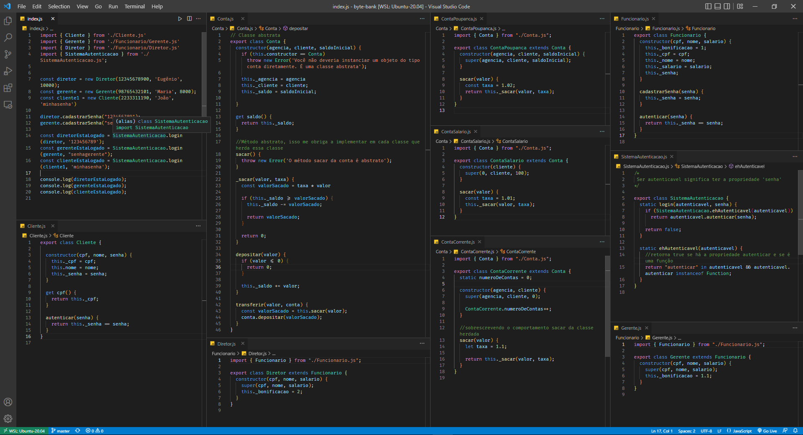

# Curso de JavaScript: programando a Orientação a Objetos e JavaScript: interfaces e Herança em Orientação a Objetos

## Visto no curso de JavaScript: programando a Orientação a Objetos
<ul>
<li>Domine o paradigma de programação mais usado no mercado</li>
<li>Entenda  o que são referências e objetos</li>
<li>Use atributos, métodos da instância e da classe</li>
<li>Defina objetos através de construtores</li>
<li>Aprenda sobre encapsulamento</li>
</ul>

  

Preview curso de JavaScript: programando a Orientação a Objetos

   

## Visto no curso de JavaScript: interfaces e Herança em Orientação a Objetos

<ul>
<li>Aprofunde seus conhecimentos em Orientação a objetos</li>
<li>Saiba o que é o "DuckType"</li>
<li>Entenda quando e como usar herança dentro de seus projetos</li>
<li>Conheça boas práticas de programação</li>
<li>Veja código JavaScript moderno que você pode utilizar em seus projetos</li>
</ul>

  

Preview curso de JavaScript: interfaces e Herança em Orientação a Objetos

   